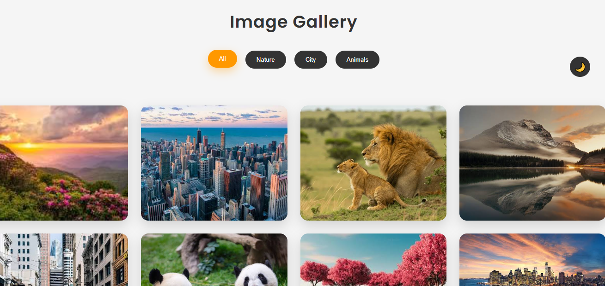
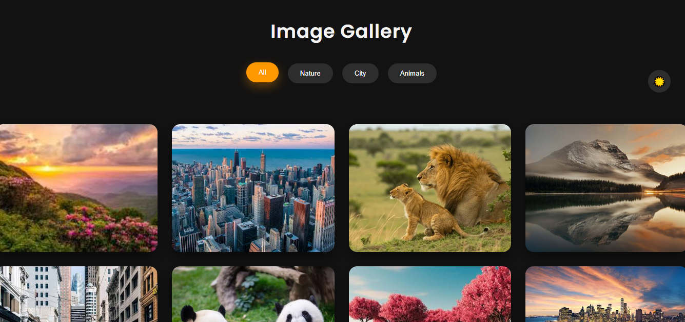
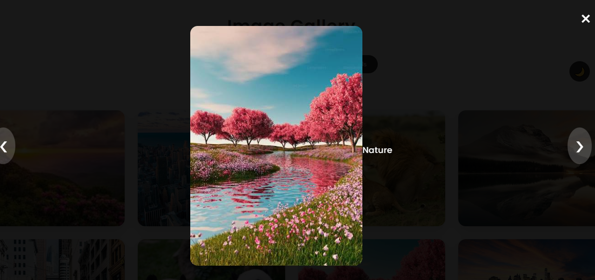

 🖼️ Interactive Image Gallery


A modern, responsive, and interactive Image Gallery built using **HTML5**, **CSS3**, and **JavaScript**.

The project allows users to browse images by category, preview them in a lightbox, navigate using buttons or keyboard shortcuts, and switch between Light and Dark Mode with theme persistence using Local Storage.


 📖 Project Overview

This project was developed as part of my Frontend Development learning journey and Internship preparation.

The goal was to create a clean, responsive, and user-friendly image gallery while practicing modern HTML, CSS, and JavaScript concepts.

The project focuses on:

- Responsive Web Design
- Clean User Interface
- DOM Manipulation
- JavaScript Event Handling
- CSS Grid & Flexbox
- Accessibility
- Reusable JavaScript Functions

---

 ✨ Features

- ✅ Responsive Image Gallery
- ✅ Category Filtering
- ✅ Interactive Lightbox
- ✅ Previous & Next Navigation
- ✅ Keyboard Navigation
- ✅ Click Outside to Close
- ✅ Dark / Light Theme
- ✅ Theme Persistence using Local Storage
- ✅ Image Captions
- ✅ Smooth Hover Animations
- ✅ Fade Transition Effects
- ✅ Mobile Friendly Design
- ✅ Accessible Navigation Buttons


 📸 Screenshots

## 🌞 Light Mode



---

## 🌙 Dark Mode



---

## 🔍 Lightbox



---

# 🛠 Technologies Used

- HTML5
- CSS3
- JavaScript (ES6)
- CSS Grid
- Flexbox
- CSS Variables
- Local Storage
- DOM Manipulation

📂 Folder Structure

Image-Gallery/

│── index.html
│── style.css
│── script.js
│── README.md
│
├── images/
│     img1.jpg
│     img2.jpg
│     img3.jpg
│     ...
│
└── screenshots/
      home-light.png
      home-dark.png
      lightbox.png


# 🚀 How to Run

1. Clone this repository

```bash
git clone https://github.com/your-username/Image-Gallery.git
```

or simply download the ZIP file.

2. Open the project folder.

3. Open

"text
index.html"


in your browser.

No installation is required.

 📱 Responsive Design

The gallery is fully responsive and automatically adjusts for different screen sizes.

 Desktop

✔ Multi-column layout

 Laptop

✔ Responsive spacing

 Tablet

✔ Two-column gallery

 Mobile

✔ Single-column layout


 🎨 UI Features

- Modern Card Design
- Rounded Corners
- Smooth Hover Effects
- Interactive Buttons
- Responsive Toolbar
- Professional Color Palette
- Dark Mode Support
- Smooth Theme Switching

 ⚡ JavaScript Features

- DOM Selection
- Event Listeners
- Functions
- Arrays
- Image Filtering
- Dynamic Lightbox
- Keyboard Navigation
- Local Storage
- Dynamic Theme Switching
- Image Caption Updates

 💡 Concepts Learned

While building this project, I practiced and improved my understanding of:

- Semantic HTML
- CSS Grid
- Flexbox
- Media Queries
- CSS Variables
- Responsive Design
- CSS Transitions
- CSS Animations
- JavaScript DOM Manipulation
- Event Handling
- Functions
- Arrays
- Data Attributes
- Local Storage
- Keyboard Events
- Code Organization

 🔮 Future Improvements

Some features I would like to add in the future:

- 🔍 Image Search
- ❤️ Favorite Images
- ⬇ Download Image
- 📤 Upload Custom Images
- 🖼 Masonry Layout
- ⚡ Lazy Loading
- 🎞 Slideshow Mode
- 🌐 Fetch Images from an API

 🎯 Learning Objectives

This project helped me understand how to:

- Build responsive layouts
- Manipulate the DOM using JavaScript
- Create reusable functions
- Work with CSS Grid and Flexbox
- Build an interactive Lightbox
- Store user preferences using Local Storage
- Improve UI/UX with animations and transitions

 👩‍💻 Author

Sobia Iqbal

Computer Software Engineering Student

University of Engineering & Technology, Mardan

 ⭐ If you like this project

If you found this project helpful or interesting, consider giving it a ⭐ on GitHub.

It motivates me to continue learning and building more projects.


 
